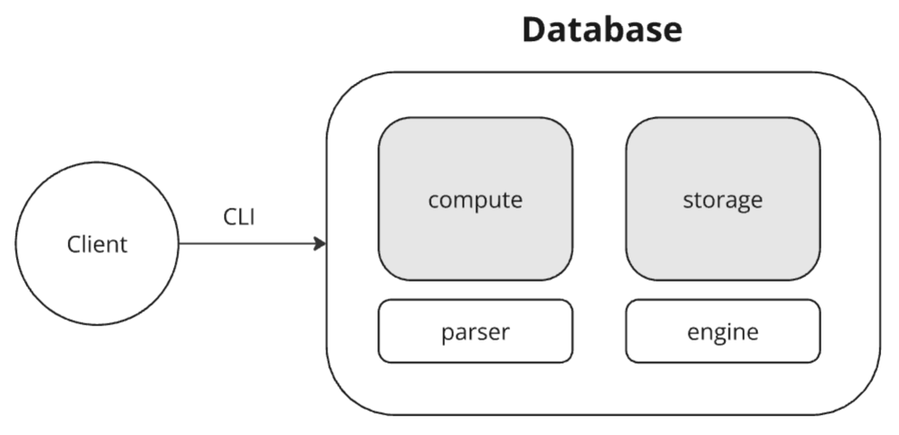

# Техническое задание: In-Memory Key-Value хранилище

## STEP ONE
### Цель
Реализовать in-memory key-value хранилище с CLI-интерфейсом и минимальным языком запросов. Архитектура должна быть многослойной и модульной, с возможностью масштабирования в будущем.

### Требования к архитектуре
Использовать многослойную архитектуру, изолируя слои интерфейсами.

#### На первом этапе реализуются два слоя:



- **compute** — отвечает за обработку запросов.
- **parser** — компонент внутри compute, занимается синтаксическим разбором текстовых команд.
- **storage** — отвечает за хранение данных.
- **engine** — in-memory движок, реализующий хранение данных в виде хэш-таблицы (map[string]string).

Взаимодействие между слоями строится по принципу пайплайна: запрос → compute → storage.

### Язык запросов
Минимальный язык запросов, соответствующий следующей грамматике (eBNF):

```ini
query        = set_command | get_command | del_command
set_command  = "SET" argument argument
get_command  = "GET" argument
del_command  = "DEL" argument
argument     = punctuation | letter | digit { punctuation | letter | digit }

punctuation  = "*" | "/" | "_" | ...
letter       = "a" .. "z" | "A" .. "Z"
digit        = "0" .. "9"
```

### Примеры валидных команд:
```shell
SET weather_2_pm cold_moscow_weather
GET /etc/nginx/config
DEL user_****
```
- Команды регистрочувствительны (SET, GET, DEL — строго в верхнем регистре).
- Разделителями между токенами считаются любые пробельные символы.
- Все аргументы — строки, допускающие буквы, цифры и знаки пунктуации.

### Особенности реализации
- Вся логика реализуется в памяти. После перезапуска приложения данные теряются.
- Используется in-memory хранилище (map[string]string), реализованное внутри engine.
- Взаимодействие с системой осуществляется только через командную строку.
- Обработка команд должна быть расширяема, например, для добавления новых операций (UPDATE, LIST и др.).